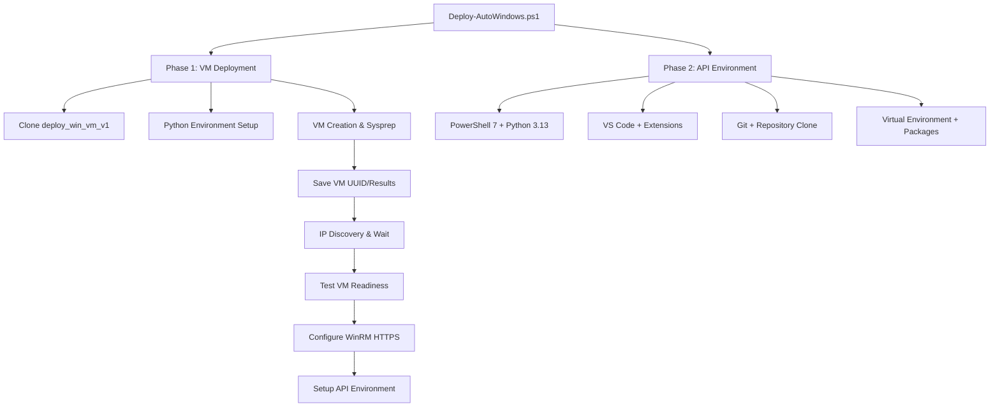

# Auto-Windows: Automated VM Deployment & API Environment Setup

## 🚀 Overview

Auto-Windows provides a complete **two-phase automation solution** for deploying Windows VMs on Nutanix and setting up comprehensive API development environments. The system seamlessly integrates multiple repositories to deliver end-to-end automation with intelligent IP discovery, secure PowerShell remoting, and comprehensive environment setup.

### ✨ What Auto-Windows Does

1. **PHASE 1**: Deploy Windows VMs using [`deploy_win_vm_v1`](https://github.com/hardevsanghera/deploy_win_vm_v1)
2. **PHASE 2**: Setup Nutanix v4 API environment using [`ntnx-v4api-cats`](https://github.com/hardevsanghera/ntnx-v4api-cats)

### 🎯 Key Features

- **🤖 Full Automation**: Complete end-to-end deployment with minimal user interaction
- **🔍 Intelligent IP Discovery**: Automatic VM IP detection with configurable waiting/retry logic
- **🔒 Secure by Default**: HTTPS PowerShell remoting with SSL certificate bypass
- **⚡ VM Readiness Testing**: Automated connectivity and prerequisite validation
- **🛠️ WinRM HTTPS Setup**: Interactive configuration of secure remoting on target VMs
- **📊 Comprehensive Logging**: Detailed execution tracking and error reporting
- **🔄 Flexible Execution**: Run individual phases or complete workflow

## 🏃‍♂️ Quick Start (5 minutes)

```powershell
# 1. Clone and setup
git clone https://github.com/hardevsanghera/auto-windows.git
cd auto-windows

# 2. Full automated deployment
.\Deploy-AutoWindows.ps1 -Phase All

# 3. Or run phases individually
.\Deploy-AutoWindows.ps1 -Phase 1    # VM deployment only
.\Deploy-AutoWindows.ps1 -Phase 2    # API environment only
```

## 🏗️ Architecture & Workflow



## 📁 Repository Structure

```
auto-windows/
├── README.md                           # This file
├── Deploy-AutoWindows.ps1              # 🎯 Master orchestration script
├── Setup-Phase2-ApiEnvironment.ps1     # 🔧 Standalone Phase 2 execution
├── Test-VMReadiness.ps1                # ✅ VM connectivity & readiness testing
├── Get-VMIPAddress.ps1                 # 🔍 IP discovery from Prism Central
├── PasswordManager.ps1                 # 🔐 Secure credential management
├── config/                             # ⚙️ Configuration files
│   ├── deployment-config.json          # VM deployment settings
│   ├── environment-config.json         # API environment settings
│   └── settings.json                   # Global settings
├── phase1/                             # 🏗️ VM Deployment components
│   ├── Initialize-VMDeployment.ps1     # Main Phase 1 orchestrator
│   ├── Get-ExternalRepo.ps1            # Repository cloning
│   └── Invoke-VMDeployment.ps1         # VM deployment execution
├── docs/                              # 📚 Comprehensive documentation
├── logs/                              # 📋 Execution logs (auto-created)
└── temp/                              # 🗂️ Temporary files (auto-created)
```

## 🔧 Core Scripts & Features

### `Deploy-AutoWindows.ps1` - Master Orchestrator
```powershell
# Complete deployment
.\Deploy-AutoWindows.ps1 -Phase All

# Individual phases
.\Deploy-AutoWindows.ps1 -Phase 1
.\Deploy-AutoWindows.ps1 -Phase 2

# Non-interactive mode
.\Deploy-AutoWindows.ps1 -NonInteractive
```

### `Setup-Phase2-ApiEnvironment.ps1` - Standalone API Setup
```powershell
# Secure HTTPS setup (default)
.\Setup-Phase2-ApiEnvironment.ps1 -VMIPAddress 10.38.19.22

# Force HTTP if needed
.\Setup-Phase2-ApiEnvironment.ps1 -VMIPAddress 10.38.19.22 -UseHTTPS:$false
```

### `Test-VMReadiness.ps1` - VM Validation & Setup
```powershell
# Basic connectivity test
.\Test-VMReadiness.ps1 -VMIPAddress 10.38.19.22

# Full readiness assessment with TrustedHosts setup
.\Test-VMReadiness.ps1 -VMIPAddress 10.38.19.22 -AddToTrusted -TestLevel Full
```

### `Get-VMIPAddress.ps1` - Intelligent IP Discovery
```powershell
# Discover latest deployed VM IP
.\Get-VMIPAddress.ps1

# Query specific VM
.\Get-VMIPAddress.ps1 -VMUUID "44fee51f-5424-4752-8b66-e74e1ef317ab"
```

## 🎯 Advanced Automation Features

### 🔍 Intelligent IP Discovery
- **Automatic Waiting**: Waits up to 15 minutes for DHCP assignment
- **Retry Logic**: Checks every 30 seconds with exponential backoff
- **Output Parsing**: Extracts IP from Prism Central API responses
- **Fallback Options**: Manual entry or extended waiting periods

### 🔒 Secure PowerShell Remoting
- **HTTPS by Default**: Uses port 5986 with SSL certificate bypass
- **Automatic Setup**: Interactive WinRM HTTPS configuration on target VMs
- **Certificate Management**: Creates self-signed certificates automatically
- **Firewall Configuration**: Opens required ports across all Windows profiles

### ✅ VM Readiness Testing
- **Multi-Level Testing**: Basic, Standard, and Full assessment modes
- **Connectivity Validation**: Network, RDP, WinRM (HTTP/HTTPS), SSH
- **Prerequisites Check**: .NET Framework, PowerShell, WMI, Internet access
- **Interactive Fixes**: Prompts to configure missing components

## 📦 What Gets Deployed

### 🏗️ Phase 1: Windows VM Deployment
- **VM Creation**: Deploys to Nutanix AHV clusters using v3.1 API
- **Resource Selection**: Interactive cluster, network, and image selection
- **Sysprep Customization**: Windows configuration and domain join
- **Progress Monitoring**: Real-time deployment status tracking

### 🛠️ Phase 2: Nutanix v4 API Environment
- **PowerShell 7.4+**: Latest cross-platform PowerShell
- **Python 3.13**: With virtual environment and package management
- **Visual Studio Code 1.105+**: With PowerShell, Python, YAML extensions
- **Git 2.42+**: Version control with Chocolatey installation
- **API Repository**: Complete [`ntnx-v4api-cats`](https://github.com/hardevsanghera/ntnx-v4api-cats) environment
- **Python Packages**: requests, pandas, openpyxl, urllib3

## 🔧 Prerequisites

- **Windows OS**: Windows 10/11, Server 2019/2022
- **PowerShell**: 5.1+ (PowerShell 7+ recommended)
- **Network Access**: Internet connectivity + Nutanix Prism Central access
- **Permissions**: Administrator rights recommended for Phase 2
- **Nutanix Environment**: Prism Central with AHV clusters

## 🎮 Usage Examples

### Complete Automated Deployment
```powershell
# Deploy VM and setup API environment with full automation
.\Deploy-AutoWindows.ps1 -Phase All
```

### Development Environment Setup
```powershell
# Setup API environment on existing VM
.\Setup-Phase2-ApiEnvironment.ps1 -VMIPAddress 10.38.19.22
```

### VM Validation and Preparation
```powershell
# Test VM and setup secure remoting
.\Test-VMReadiness.ps1 -VMIPAddress 10.38.19.22 -AddToTrusted -TestLevel Full
```

### IP Discovery for Manual Phase 2
```powershell
# Find VM IP, then run Phase 2
$vmIP = .\Get-VMIPAddress.ps1
.\Setup-Phase2-ApiEnvironment.ps1 -VMIPAddress $vmIP
```

## 🔍 Troubleshooting & Diagnostics

### Execution Logs
```powershell
# Check detailed logs
Get-Content logs\deploy-auto-windows.log -Tail 50
Get-Content logs\phase1.log -Tail 20
Get-Content logs\phase2.log -Tail 20
```

### Common Scenarios
```powershell
# VM not getting IP address
.\Get-VMIPAddress.ps1 -MaxRetries 10 -RetryDelay 60

# PowerShell remoting issues
.\Test-VMReadiness.ps1 -VMIPAddress <IP> -AddToTrusted

# HTTPS configuration problems
# (Script will prompt for automatic setup)

# Clear cached passwords
.\Deploy-AutoWindows.ps1 -DelPw
```

## 🚀 Integration & Automation

### CI/CD Pipeline Integration
```powershell
# Non-interactive deployment
.\Deploy-AutoWindows.ps1 -NonInteractive -SkipPrerequisites
```

### Infrastructure as Code
```powershell
# Custom configuration
.\Deploy-AutoWindows.ps1 -ConfigDirectory "environments\production"
```

## 🔗 Source Repositories

- **VM Deployment**: [`deploy_win_vm_v1`](https://github.com/hardevsanghera/deploy_win_vm_v1) - Python-based Nutanix VM deployment
- **API Environment**: [`ntnx-v4api-cats`](https://github.com/hardevsanghera/ntnx-v4api-cats) - Nutanix v4 API development tools

## 🤝 Contributing

1. Fork the repository
2. Create a feature branch
3. Test thoroughly with both phases
4. Update documentation as needed
5. Submit a pull request

## 📄 License

Educational and development use. See individual source repositories for specific licenses.

## 👨‍💻 Author

**Hardev Sanghera** - Nutanix Solution Architect  
*October 2025*

---

## 🆘 Support & Resources

- **📚 Documentation**: Complete guides in `docs/` directory
- **🔧 Configuration**: Interactive setup with validation tools
- **📋 Logging**: Comprehensive execution tracking in `logs/`
- **🌐 Community**: Report issues via repository issue tracker
- **💡 Examples**: Real-world scenarios in `docs/EXAMPLES.md`