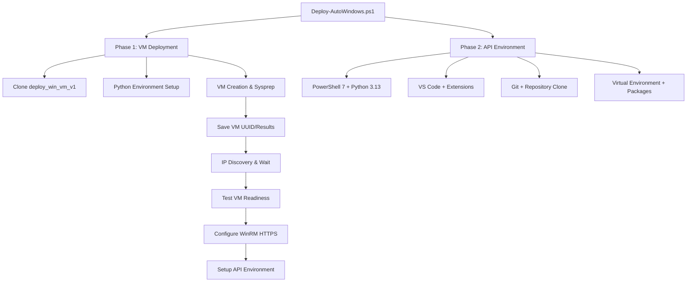

# Auto-Windows: Advanced Usage Guide

## 📋 Table of Contents

- [Architecture Overview](#architecture-overview)
- [Intelligent Automation Features](#intelligent-automation-features)
- [Security & HTTPS Configuration](#security--https-configuration)
- [Advanced Configuration Management](#advanced-configuration-management)
- [Advanced Deployment Scenarios](#advanced-deployment-scenarios)
- [Customization and Extension](#customization-and-extension)
- [Troubleshooting & Diagnostics](#troubleshooting--diagnostics)
- [API Reference](#api-reference)

## 🏗️ Architecture Overview

### Enhanced Two-Phase Design

Auto-Windows implements an intelligent two-phase deployment architecture with automatic IP discovery and secure HTTPS connectivity:



### Component Architecture

```
Deploy-AutoWindows.ps1 (Master Orchestrator)
    ├── Phase1/
    │   ├── Initialize-VMDeployment.ps1      # VM deployment orchestrator
    │   ├── Get-ExternalRepo.ps1             # Repository management
    │   └── Invoke-VMDeployment.ps1          # VM deployment execution
    ├── Setup-Phase2-ApiEnvironment.ps1     # Standalone Phase 2 script
    ├── Test-VMReadiness.ps1                 # VM testing & HTTPS setup
    ├── Get-VMIPAddress.ps1                  # Intelligent IP discovery
    ├── PasswordManager.ps1                  # Secure credential handling
    └── Config/
        ├── settings.json                    # Global settings
        ├── deployment-config.json           # VM deployment configuration
        └── environment-config.json          # API environment configuration
```

## 🤖 Intelligent Automation Features

### Automatic IP Discovery
The system provides comprehensive IP discovery with intelligent waiting:

```powershell
# Built-in IP discovery with timeout
.\Get-VMIPAddress.ps1 -MaxRetries 10 -RetryDelay 60

# Discover specific VM by UUID
.\Get-VMIPAddress.ps1 -VMUUID "44fee51f-5424-4752-8b66-e74e1ef317ab"

# Integration with Phase 2
$vmIP = .\Get-VMIPAddress.ps1
if ($vmIP) {
    .\Setup-Phase2-ApiEnvironment.ps1 -VMIPAddress $vmIP
}
```

**Features:**
- **15-minute timeout** for DHCP assignment
- **30-second intervals** with exponential backoff
- **Prism Central API integration** for real-time IP discovery
- **Output parsing** to extract IP from JSON responses
- **Fallback prompts** for manual entry or extended waiting

### VM Readiness Assessment
Comprehensive VM testing with multi-level assessment:

```powershell
# Basic connectivity test
.\Test-VMReadiness.ps1 -VMIPAddress 10.38.19.22

# Standard assessment with TrustedHosts setup
.\Test-VMReadiness.ps1 -VMIPAddress 10.38.19.22 -AddToTrusted

# Full assessment with comprehensive checks
.\Test-VMReadiness.ps1 -VMIPAddress 10.38.19.22 -AddToTrusted -TestLevel Full
```

**Assessment Levels:**
- **Basic**: Network connectivity, ping, port checks
- **Standard**: Adds WinRM HTTP/HTTPS, RDP testing
- **Full**: Comprehensive checks including SSH, prerequisites, WMI

### Intelligent Phase Coordination
Enhanced orchestration between phases:

```powershell
# Built-in IP discovery and coordination
.\Deploy-AutoWindows.ps1 -Phase All

# Manual coordination with validation
.\Deploy-AutoWindows.ps1 -Phase 1
$vmIP = .\Get-VMIPAddress.ps1
.\Test-VMReadiness.ps1 -VMIPAddress $vmIP -TestLevel Full
.\Setup-Phase2-ApiEnvironment.ps1 -VMIPAddress $vmIP
```

## 🔒 Security & HTTPS Configuration

### HTTPS by Default
Auto-Windows uses secure HTTPS connectivity with comprehensive SSL bypass for lab environments:

```powershell
# HTTPS is now the default for Phase 2
.\Setup-Phase2-ApiEnvironment.ps1 -VMIPAddress 10.38.19.22

# Force HTTP if absolutely needed
.\Setup-Phase2-ApiEnvironment.ps1 -VMIPAddress 10.38.19.22 -UseHTTPS:$false
```

### SSL Certificate Bypass
Enhanced session options for lab environments:

```powershell
# Comprehensive SSL bypass configuration
$sessionOptions = New-PSSessionOption -SkipCACheck -SkipCNCheck -SkipRevocationCheck
$session = New-PSSession -ComputerName $VMIPAddress -Port 5986 -UseSSL -SessionOption $sessionOptions
```

### Interactive HTTPS Setup
Automatic WinRM HTTPS configuration when needed:

```
WinRM HTTPS (port 5986) connection failed. This is common for new VMs.
Would you like me to configure WinRM HTTPS on the remote VM? [Y/N]: Y

Setting up WinRM HTTPS on 10.38.19.22...
✓ Creating self-signed certificate for secure connections...
✓ Configuring HTTPS listener on port 5986...
✓ Adding firewall rules for all Windows profiles...
✓ Verifying HTTPS listener configuration...
✓ WinRM HTTPS is now available for secure connections
```

### Certificate Management
Automatic certificate creation and management:

```powershell
# Self-signed certificate creation
$cert = New-SelfSignedCertificate -DnsName $env:COMPUTERNAME -CertStoreLocation Cert:\LocalMachine\My

# HTTPS listener configuration
winrm create winrm/config/Listener?Address=*+Transport=HTTPS "@{Hostname=\"$env:COMPUTERNAME\";CertificateThumbprint=\"$($cert.Thumbprint)\"}"

# Firewall rule management
New-NetFirewallRule -DisplayName "WinRM HTTPS" -Direction Inbound -LocalPort 5986 -Protocol TCP -Action Allow
```

## ⚙️ Advanced Configuration Management

### Environment-Specific Configurations

#### Development Environment
```json
{
  "prismCentral": {
    "ip": "192.168.1.100",
    "username": "dev-admin",
    "useHTTPS": true,
    "port": 9440
  },
  "vmConfiguration": {
    "namePrefix": "DEV-WIN-",
    "adminPassword": "DevPassword123!",
    "domain": {
      "join": true,
      "name": "dev.company.com"
    }
  },
  "security": {
    "useHTTPS": true,
    "allowSelfSignedCerts": true,
    "skipCertificateValidation": true
  }
}
```

#### Production Environment
```json
{
  "prismCentral": {
    "ip": "10.1.1.100", 
    "username": "prod-admin",
    "useHTTPS": true,
    "port": 9440
  },
  "vmConfiguration": {
    "namePrefix": "PROD-WIN-",
    "domain": {
      "join": true,
      "name": "prod.company.com"
    }
  },
  "security": {
    "useHTTPS": true,
    "allowSelfSignedCerts": false,
    "enforceStrictSSL": true
  }
}
```

### Enhanced Configuration Templates

```powershell
# Development with HTTPS bypass
.\Setup-Configuration.ps1 -Action Setup -ConfigType dev -Interactive

# Production with strict SSL
.\Setup-Configuration.ps1 -Action Setup -ConfigType prod -Interactive

# Full installation with all components
.\Setup-Configuration.ps1 -Action Setup -ConfigType full -Interactive

# Minimal installation for resource-constrained environments
.\Setup-Configuration.ps1 -Action Setup -ConfigType minimal -Interactive
```

## 🚀 Advanced Deployment Scenarios

### Scenario 1: Complete Automated Workflow
Full end-to-end deployment with intelligent automation:

```powershell
# Single command for complete deployment
.\Deploy-AutoWindows.ps1 -Phase All -NonInteractive

# With custom waiting parameters
.\Deploy-AutoWindows.ps1 -Phase All -VMWaitTimeout 20 -RetryInterval 45
```

### Scenario 2: Staged Deployment with Validation
Manual control over each phase with comprehensive validation:

```powershell
# Phase 1: VM Deployment
.\Deploy-AutoWindows.ps1 -Phase 1
$results = Get-Content "phase1_results.json" | ConvertFrom-Json

# IP Discovery with extended waiting
$vmIP = .\Get-VMIPAddress.ps1 -VMUUID $results.VMUUID -MaxRetries 15

# Comprehensive VM Testing
.\Test-VMReadiness.ps1 -VMIPAddress $vmIP -TestLevel Full -AddToTrusted

# Phase 2: API Environment with HTTPS
.\Setup-Phase2-ApiEnvironment.ps1 -VMIPAddress $vmIP -UseHTTPS:$true
```

### Scenario 3: Multiple VM Deployment
Deploy multiple VMs with different configurations:

```powershell
# Deploy development VMs
foreach ($vmConfig in $devConfigs) {
    Copy-Item $vmConfig config\deployment-config.json
    .\Deploy-AutoWindows.ps1 -Phase 1 -NonInteractive
    
    # Setup API environment on each
    $vmIP = .\Get-VMIPAddress.ps1
    .\Setup-Phase2-ApiEnvironment.ps1 -VMIPAddress $vmIP
}
```

### Scenario 4: Disaster Recovery and Backup
Automated backup and recovery workflows:

```powershell
# Backup current configuration
Copy-Item config\*.json "backup\$(Get-Date -Format 'yyyyMMdd')"

# Deploy replacement VM
.\Deploy-AutoWindows.ps1 -Phase 1 -ConfigDirectory "backup\20241025"

# Restore API environment
.\Setup-Phase2-ApiEnvironment.ps1 -VMIPAddress $newVMIP -RestoreFromBackup
```

### Scenario 5: CI/CD Pipeline Integration
Advanced automation for continuous deployment:

```yaml
# Azure DevOps Pipeline
steps:
- task: PowerShell@2
  displayName: 'Deploy VM Environment'
  inputs:
    targetType: 'filePath'
    filePath: 'Deploy-AutoWindows.ps1'
    arguments: '-Phase All -NonInteractive -LogDirectory $(Build.ArtifactStagingDirectory)\logs'
  env:
    PC_USERNAME: $(PrismCentralUsername)
    PC_PASSWORD: $(PrismCentralPassword)
    VM_ADMIN_PASSWORD: $(VMAdminPassword)

- task: PublishTestResults@2
  displayName: 'Publish VM Readiness Results'
  inputs:
    testResultsFiles: 'logs\readiness-test-results.xml'
```

## 🔧 Customization and Extension

### Custom Component Installation
Extend Phase 2 with additional development tools:

```powershell
# Custom installation function
function Install-CustomDevelopmentTools {
    param([string]$VMIPAddress)
    
    $session = New-PSSession -ComputerName $VMIPAddress -Port 5986 -UseSSL
    
    Invoke-Command -Session $session -ScriptBlock {
        # Install Docker Desktop
        winget install Docker.DockerDesktop
        
        # Install Postman
        winget install Postman.Postman
        
        # Install Jupyter
        pip install jupyter notebook
        
        # Custom PowerShell modules
        Install-Module -Name Nutanix.Cli -Force
    }
    
    Remove-PSSession $session
}

# Integration with main workflow
.\Setup-Phase2-ApiEnvironment.ps1 -VMIPAddress $vmIP
Install-CustomDevelopmentTools -VMIPAddress $vmIP
```

### Custom WinRM Configuration
Advanced PowerShell remoting setup:

```powershell
# Custom WinRM configuration
function Set-AdvancedWinRMConfig {
    param([string]$VMIPAddress)
    
    $session = New-PSSession -ComputerName $VMIPAddress -Port 5986 -UseSSL
    
    Invoke-Command -Session $session -ScriptBlock {
        # Enhanced WinRM settings
        winrm set winrm/config/service '@{MaxConcurrentOperationsPerUser="100"}'
        winrm set winrm/config/service '@{MaxConnections="300"}'
        winrm set winrm/config/winrs '@{MaxMemoryPerShellMB="1024"}'
        
        # Advanced authentication
        winrm set winrm/config/service/auth '@{Basic="true";Kerberos="true";Negotiate="true";Certificate="true"}'
        
        # Custom listeners for specific subnets
        winrm create winrm/config/Listener?Address=192.168.1.0/24+Transport=HTTPS "@{Hostname=\"$env:COMPUTERNAME\";CertificateThumbprint=\"$certThumbprint\"}"
    }
}
```

### Post-Deployment Automation Scripts
Comprehensive post-deployment configuration:

```powershell
# Advanced post-deployment script
param(
    [object]$DeploymentResults,
    [string]$EnvironmentType = "Development"
)

if ($DeploymentResults.Phase1.Success) {
    $vmIP = Get-VMIPFromResults -Results $DeploymentResults.Phase1
    
    # Advanced VM configuration
    Set-VMSecurityPolicies -VMIPAddress $vmIP -EnvironmentType $EnvironmentType
    Install-SecurityTools -VMIPAddress $vmIP
    Configure-NetworkSettings -VMIPAddress $vmIP
    
    # Environment-specific setup
    switch ($EnvironmentType) {
        "Development" { 
            Install-DevelopmentTools -VMIPAddress $vmIP
            Set-DeveloperPermissions -VMIPAddress $vmIP
        }
        "Production" { 
            Set-ProductionSecuritySettings -VMIPAddress $vmIP
            Install-MonitoringAgents -VMIPAddress $vmIP
        }
        "Testing" { 
            Install-TestingFrameworks -VMIPAddress $vmIP
            Configure-TestDataSources -VMIPAddress $vmIP
        }
    }
}
```

## 🔍 Troubleshooting & Diagnostics

### Enhanced Diagnostic Tools

#### Comprehensive Connectivity Testing
```powershell
# Multi-level connectivity diagnostics
function Test-ComprehensiveConnectivity {
    param([string]$VMIPAddress)
    
    $results = @{}
    
    # Network layer
    $results.Ping = Test-NetConnection $VMIPAddress -InformationLevel Quiet
    $results.HTTP_WinRM = Test-NetConnection $VMIPAddress -Port 5985 -InformationLevel Quiet
    $results.HTTPS_WinRM = Test-NetConnection $VMIPAddress -Port 5986 -InformationLevel Quiet
    $results.RDP = Test-NetConnection $VMIPAddress -Port 3389 -InformationLevel Quiet
    $results.SSH = Test-NetConnection $VMIPAddress -Port 22 -InformationLevel Quiet
    
    # PowerShell remoting tests
    try {
        $results.WinRM_HTTP_Session = [bool](New-PSSession -ComputerName $VMIPAddress -Port 5985 -ErrorAction Stop)
    } catch { $results.WinRM_HTTP_Session = $false }
    
    try {
        $sessionOptions = New-PSSessionOption -SkipCACheck -SkipCNCheck -SkipRevocationCheck
        $results.WinRM_HTTPS_Session = [bool](New-PSSession -ComputerName $VMIPAddress -Port 5986 -UseSSL -SessionOption $sessionOptions -ErrorAction Stop)
    } catch { $results.WinRM_HTTPS_Session = $false }
    
    return $results
}
```

#### IP Discovery Diagnostics
```powershell
# Enhanced IP discovery with comprehensive logging
function Get-DetailedVMIPStatus {
    param([string]$VMUUID, [int]$MaxRetries = 10)
    
    for ($i = 1; $i -le $MaxRetries; $i++) {
        Write-Host "Attempt $i of $MaxRetries - Checking VM IP status..."
        
        $apiResponse = Invoke-RestMethod -Uri $prismAPI -Headers $headers
        $vmData = $apiResponse.entities | Where-Object { $_.metadata.uuid -eq $VMUUID }
        
        if ($vmData) {
            Write-Host "VM Found: $($vmData.spec.name)"
            Write-Host "Power State: $($vmData.spec.resources.power_state)"
            
            $nicList = $vmData.spec.resources.nic_list
            foreach ($nic in $nicList) {
                if ($nic.ip_endpoint_list) {
                    $ipAddress = $nic.ip_endpoint_list[0].ip
                    Write-Host "✓ IP Address discovered: $ipAddress"
                    return $ipAddress
                }
            }
            Write-Host "⚠ VM found but no IP assigned yet"
        } else {
            Write-Host "❌ VM not found in API response"
        }
        
        Start-Sleep 30
    }
    
    return $null
}
```

### Advanced Error Handling

#### HTTPS Configuration Issues
```powershell
# Comprehensive HTTPS troubleshooting
function Resolve-WinRMHTTPSIssues {
    param([string]$VMIPAddress)
    
    Write-Host "Diagnosing WinRM HTTPS issues for $VMIPAddress..."
    
    # Test basic connectivity
    if (-not (Test-NetConnection $VMIPAddress -Port 5986 -InformationLevel Quiet)) {
        Write-Warning "Port 5986 not accessible. Attempting to configure WinRM HTTPS..."
        
        # Use HTTP to configure HTTPS
        $session = New-PSSession -ComputerName $VMIPAddress -Port 5985
        Invoke-Command -Session $session -ScriptBlock {
            # Create self-signed certificate
            $cert = New-SelfSignedCertificate -DnsName $env:COMPUTERNAME -CertStoreLocation Cert:\LocalMachine\My
            
            # Configure HTTPS listener
            $listenerExists = Get-WSManInstance -ResourceURI "winrm/config/Listener" -SelectorSet @{Address="*";Transport="HTTPS"} -ErrorAction SilentlyContinue
            if (-not $listenerExists) {
                winrm create winrm/config/Listener?Address=*+Transport=HTTPS "@{Hostname=\"$env:COMPUTERNAME\";CertificateThumbprint=\"$($cert.Thumbprint)\"}"
            }
            
            # Configure firewall
            $firewallRule = Get-NetFirewallRule -DisplayName "WinRM HTTPS" -ErrorAction SilentlyContinue
            if (-not $firewallRule) {
                New-NetFirewallRule -DisplayName "WinRM HTTPS" -Direction Inbound -LocalPort 5986 -Protocol TCP -Action Allow -Profile Any
            }
        }
        Remove-PSSession $session
        
        # Verify HTTPS is now working
        Start-Sleep 5
        if (Test-NetConnection $VMIPAddress -Port 5986 -InformationLevel Quiet) {
            Write-Host "✓ WinRM HTTPS successfully configured"
            return $true
        } else {
            Write-Error "Failed to configure WinRM HTTPS"
            return $false
        }
    }
    
    # Test SSL session establishment
    try {
        $sessionOptions = New-PSSessionOption -SkipCACheck -SkipCNCheck -SkipRevocationCheck
        $testSession = New-PSSession -ComputerName $VMIPAddress -Port 5986 -UseSSL -SessionOption $sessionOptions
        Remove-PSSession $testSession
        Write-Host "✓ HTTPS SSL session test successful"
        return $true
    } catch {
        Write-Error "SSL session test failed: $($_.Exception.Message)"
        return $false
    }
}
```

#### Python Environment Issues
```powershell
# Python environment diagnostics and repair
function Repair-PythonEnvironment {
    param([string]$VMIPAddress)
    
    $session = New-PSSession -ComputerName $VMIPAddress -Port 5986 -UseSSL
    
    $results = Invoke-Command -Session $session -ScriptBlock {
        $diagnostics = @{}
        
        # Check Python installation
        try {
            $pythonVersion = python --version 2>&1
            $diagnostics.PythonInstalled = $true
            $diagnostics.PythonVersion = $pythonVersion
        } catch {
            $diagnostics.PythonInstalled = $false
            
            # Attempt to install Python
            Write-Host "Installing Python 3.13..."
            winget install Python.Python.3.13 --silent
            
            # Refresh PATH
            $env:PATH = [System.Environment]::GetEnvironmentVariable("PATH", "Machine")
            
            # Verify installation
            try {
                $pythonVersion = python --version 2>&1
                $diagnostics.PythonInstalled = $true
                $diagnostics.PythonVersion = $pythonVersion
            } catch {
                $diagnostics.PythonInstalled = $false
            }
        }
        
        # Check virtual environment
        if ($diagnostics.PythonInstalled) {
            $venvPath = "C:\Dev\ntnx-v4api-cats\venv"
            if (Test-Path $venvPath) {
                $diagnostics.VirtualEnvExists = $true
            } else {
                # Create virtual environment
                python -m venv $venvPath
                $diagnostics.VirtualEnvExists = Test-Path $venvPath
            }
            
            # Install packages
            if ($diagnostics.VirtualEnvExists) {
                & "$venvPath\Scripts\Activate.ps1"
                pip install requests pandas openpyxl urllib3
                $diagnostics.PackagesInstalled = $true
            }
        }
        
        return $diagnostics
    }
    
    Remove-PSSession $session
    return $results
}
```

## 📚 API Reference

### Enhanced Main Scripts

#### Deploy-AutoWindows.ps1 (Enhanced)
```powershell
.\Deploy-AutoWindows.ps1 [
    -Phase <"1"|"2"|"All">
    [-NonInteractive]
    [-ConfigDirectory <string>]
    [-WorkingDirectory <string>]
    [-LogDirectory <string>]
    [-SkipPrerequisites]
    [-VMWaitTimeout <int>]          # New: VM IP wait timeout in minutes
    [-RetryInterval <int>]          # New: Retry interval in seconds
    [-DelPw]                        # New: Delete cached passwords
]
```

#### Setup-Phase2-ApiEnvironment.ps1 (New)
```powershell
.\Setup-Phase2-ApiEnvironment.ps1 [
    -VMIPAddress <string>
    [-UseHTTPS <bool>]              # New: Defaults to $true
    [-Port <int>]                   # New: Specify custom port
    [-SkipValidation]               # New: Skip prerequisite validation
    [-CustomInstallPath <string>]   # New: Custom installation path
]
```

#### Test-VMReadiness.ps1 (Enhanced)
```powershell
.\Test-VMReadiness.ps1 [
    -VMIPAddress <string>
    [-TestLevel <"Basic"|"Standard"|"Full">]  # New: Assessment level
    [-AddToTrusted]                           # New: Add to TrustedHosts
    [-ConfigureHTTPS]                         # New: Auto-configure HTTPS
    [-TimeoutSeconds <int>]                   # New: Test timeout
]
```

#### Get-VMIPAddress.ps1 (New)
```powershell
.\Get-VMIPAddress.ps1 [
    [-VMUUID <string>]              # Specific VM UUID
    [-MaxRetries <int>]             # Maximum retry attempts
    [-RetryDelay <int>]             # Delay between retries
    [-TimeoutMinutes <int>]         # Total timeout
]
```

### Return Objects and Error Codes

#### Enhanced Phase Results
```powershell
# Phase 1 Enhanced Results
@{
    Success = $true
    VMName = "DEV-WIN-1025-1430"
    VMUUID = "12345678-1234-5678-9abc-123456789def"
    TaskUUID = "87654321-4321-8765-cba9-876543210fed"
    IPAddress = "10.38.19.22"                    # New: Discovered IP
    ReadinessTest = @{                           # New: Readiness results
        Connectivity = $true
        WinRM_HTTP = $true
        WinRM_HTTPS = $true
        Prerequisites = $true
    }
    DeploymentTime = [DateTime]
    Phase2Ready = $true                          # New: Ready for Phase 2
}

# Phase 2 Enhanced Results
@{
    Success = $true
    ConnectionMethod = "HTTPS"                   # New: Connection method used
    ValidationResults = @{
        PowerShell7 = $true
        Python = $true
        VSCode = $true
        Git = $true
        Repository = $true
        VirtualEnvironment = $true               # New: Python venv status
        PackageInstallation = $true              # New: Package status
        OverallSuccess = $true
    }
    InstalledComponents = @{                     # New: Detailed component info
        PowerShell = "7.4.5"
        Python = "3.13.0"
        VSCode = "1.105.1"
        Git = "2.42.0"
    }
    InstallationPath = "C:\Dev\ntnx-v4api-cats"
    Summary = "Installation completed successfully with HTTPS connectivity"
}
```

## 🎯 Best Practices

### Security Best Practices

1. **HTTPS First**: Always prefer HTTPS connectivity
2. **Certificate Management**: Use proper certificates in production
3. **Credential Security**: Never store passwords in configuration files
4. **Network Segmentation**: Deploy in appropriate network segments
5. **Regular Updates**: Keep components and repositories updated

### Automation Best Practices

1. **Validation First**: Always validate VM readiness before proceeding
2. **Intelligent Waiting**: Use appropriate timeouts and retry logic
3. **Comprehensive Logging**: Enable detailed logging for troubleshooting
4. **Error Handling**: Implement robust error handling and recovery
5. **Idempotent Operations**: Ensure scripts can be run multiple times safely

### Development Workflow

1. **Start with Defaults**: Use HTTPS and intelligent automation
2. **Test Incrementally**: Validate each phase independently
3. **Monitor Progress**: Use logs and status outputs for tracking
4. **Plan for Failures**: Implement comprehensive error handling
5. **Document Changes**: Keep configuration and customization documented

### Production Deployment

1. **Security Hardening**: Disable certificate bypass in production
2. **Change Management**: Follow proper change control processes
3. **Backup Strategies**: Maintain configuration and environment backups
4. **Monitoring**: Implement health checks and monitoring
5. **Disaster Recovery**: Plan for environment recovery scenarios